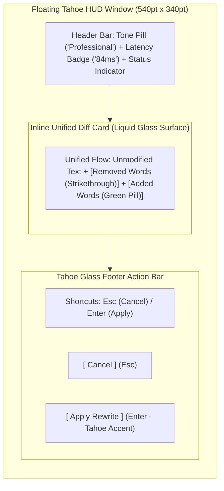
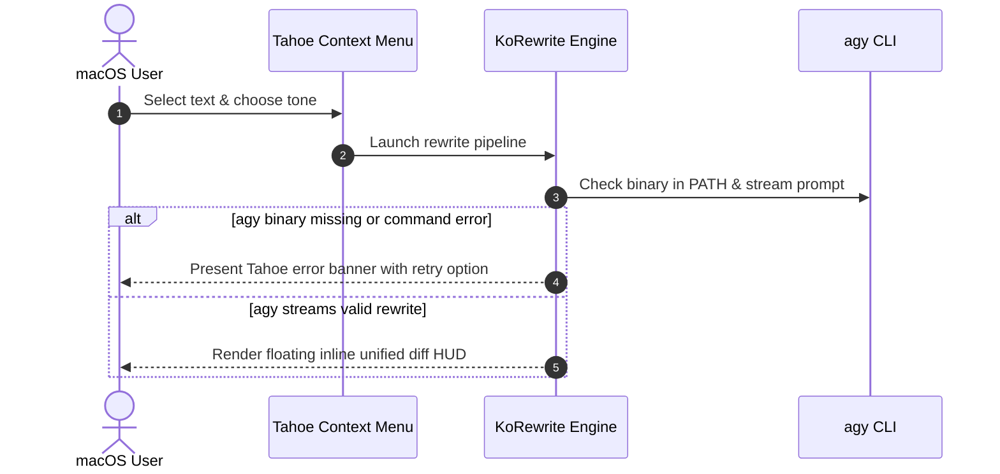

# KoRewrite Design System & UI Specifications (macOS Tahoe 26.5)

This document defines the visual design system, token definitions, typography, layout hierarchy, and interaction specifications for KoRewrite.
It serves as the single source of truth for all native macOS UI components, including the floating diff confirmation HUD modal and context menu integrations.

---

## 1. Core Visual Language & Materials

KoRewrite aligns with the macOS Tahoe 26.5 Human Interface Guidelines (HIG).
The interface utilizes refined Liquid Glass translucency, subtle specular lighting, layered elevation shadows, and rounded continuous curves.

### Window Geometry & Surface Materials
- **Corner Radius:** `16pt` continuous curvature (Squircle) for the floating preview HUD, `8pt` for action buttons and tone selector pills, `6pt` for inline diff token chips.
- **Surface Material:** `NSVisualEffectView` configured with `.hudWindow` / `.underWindowBackground` blending, or SwiftUI `.ultraThinMaterial` paired with `.background(.regularMaterial.opacity(0.85))`.
- **Specular Border:** `0.5pt` hairline specular highlight border (`LinearGradient` from `rgba(255, 255, 255, 0.22)` at top to `rgba(255, 255, 255, 0.06)` at bottom in Dark Mode; `rgba(0, 0, 0, 0.12)` to `rgba(0, 0, 0, 0.04)` in Light Mode).
- **Elevation & Shadows:** Two-tier Tahoe ambient and key shadows.
  - Key Shadow: `NSShadow` with blur radius `8pt`, y-offset `-2pt`, opacity `0.12`.
  - Ambient Shadow: `NSShadow` with blur radius `28pt`, y-offset `-8pt`, opacity `0.22`.
- **Window Dimensions:**
  - Default: `540pt` width x `340pt` height.
  - Minimum Constraints: `420pt` width x `220pt` height.
  - Maximum Constraints: `720pt` width x `560pt` height (auto-scales with scrollable inline content).

---

## 2. Semantic Color Palettes & Design Tokens

Tokens adapt dynamically between macOS Light Mode and Dark Mode with Display P3 color space fidelity.

### Surface & Border Tokens

| Token Name | Light Mode (Tahoe 26.5) | Dark Mode (Tahoe 26.5) | Description |
| :--- | :--- | :--- | :--- |
| `surface.window` | `rgba(255, 255, 255, 0.88)` | `rgba(28, 28, 30, 0.82)` | Primary Liquid Glass HUD surface |
| `surface.card.unified` | `rgba(242, 242, 247, 0.75)` | `rgba(44, 44, 46, 0.65)` | Inline unified diff card container |
| `surface.chip.tone` | `rgba(0, 122, 255, 0.12)` | `rgba(10, 132, 255, 0.20)` | Selected tone pill indicator background |
| `border.specular.top` | `rgba(255, 255, 255, 0.60)` | `rgba(255, 255, 255, 0.18)` | Upper rim specular highlight |
| `border.specular.bottom` | `rgba(0, 0, 0, 0.08)` | `rgba(255, 255, 255, 0.04)` | Lower rim shadow separator |
| `border.focus` | `#0071E3` | `#0A84FF` | Tahoe accent focus ring |

### Typography & Content Tokens

| Token Name | Light Mode | Dark Mode | Description |
| :--- | :--- | :--- | :--- |
| `text.primary` | `NSColor.labelColor` (`#1D1D1F`) | `NSColor.labelColor` (`#F5F5F7`) | Headings, unmodified text, and active labels |
| `text.secondary` | `NSColor.secondaryLabelColor` (`#6E6E73`) | `NSColor.secondaryLabelColor` (`#98989D`) | Context captions, latency metrics, shortcuts |
| `text.tertiary` | `NSColor.tertiaryLabelColor` (`#86868B`) | `NSColor.tertiaryLabelColor` (`#636366`) | Subtle hint watermarks and disabled controls |

### Inline Unified Diff Tokens

| Token Name | Light Mode (Display P3) | Dark Mode (Display P3) | Description |
| :--- | :--- | :--- | :--- |
| `diff.inline.deletion.bg` | `rgba(255, 59, 48, 0.14)` | `rgba(255, 69, 58, 0.22)` | Inline chip background for removed words |
| `diff.inline.deletion.text` | `#D70015` | `#FF453A` | Strikethrough text color for deletions |
| `diff.inline.deletion.strike` | `1.5pt` line `#D70015` | `1.5pt` line `#FF453A` | Strikethrough bar across removed characters |
| `diff.inline.addition.bg` | `rgba(52, 199, 89, 0.16)` | `rgba(48, 209, 88, 0.24)` | Inline chip background for inserted words |
| `diff.inline.addition.text` | `#248A3D` | `#30D158` | Text color for newly generated insertions |
| `diff.inline.addition.border` | `rgba(52, 199, 89, 0.35)` | `rgba(48, 209, 88, 0.40)` | Subtle border around inserted word pills |

---

## 3. Typography System

The typography scale relies on Apple SF Pro and SF Mono with optical sizing and Tahoe spacing standards.

### UI Controls & Metadata Typography (SF Pro)
- **Modal Title:** `SF Pro Display`, Semibold, `13.5pt`, Tracking `-0.1pt`.
- **Tone Selector Pill:** `SF Pro Text`, Medium, `11pt`, Tracking `+0.15pt`.
- **Control Button Labels:** `SF Pro Text`, Medium, `12pt`, Tracking `0pt`.
- **Keybinding Badge:** `SF Pro Rounded`, Semibold, `10pt`, Monospaced Digits.
- **Status & Latency Captions:** `SF Pro Text`, Regular, `10.5pt`, Secondary Label Color.

### Inline Unified Diff Typography (SF Pro & SF Mono)
- **Prose Content Mode (Default):** `SF Pro Text`, Regular, `13pt`, Line Height `19pt`.
- **Code / Exact Monospace Mode:** `SF Mono`, Regular, `12pt`, Line Height `18pt`, Optical Tabular Figures (`tnum`).
- **Inline Pill Padding:** Vertical `1.5pt`, Horizontal `4pt`, Corner Radius `4pt`.

---

## 4. Floating Confirmation HUD Layout & Components

The preview HUD features an inline unified diff view.
Users review deletions and additions seamlessly in the natural reading order before applying changes.

### Layout Architecture

### Component Specifications
1. **Tahoe Header Bar:**
   - Left side: KoRewrite branding icon and active tone capsule pill (e.g., `Polite`, `Professional`, `Concise`, `Academic`).
   - Right side: Execution latency indicator (`84ms`) with subtle activity dot.
2. **Inline Unified Diff Area:**
   - Displays a single continuous text paragraph combining original context with inline diff highlights.
   - Deletions are shown directly in-situ with strikethrough styling and soft red pill backing.
   - Additions appear immediately adjacent inside a soft green pill backing with a hairline accent border.
   - Unmodified words retain normal primary text styling for effortless reading flow.
   - Embedded inside a smooth scrollable container with Tahoe fading edge masks.
3. **Tahoe Footer Action Bar:**
   - Left side: Compact keyboard shortcut indicators (`Esc` to dismiss, `Enter` to apply).
   - Right side: Secondary `[Cancel]` glass button and Primary `[Apply Rewrite]` prominent accent button.

### Keyboard Shortcuts & Navigation
- `Enter` / `Return`: Trigger Apply (replaces active text selection in target app and dismisses HUD).
- `Escape`: Trigger Cancel (closes HUD without altering user clipboard or text).
- `Tab`: Cycle focus between tone options and action buttons.
- `1`-`4`: Quick-switch rewrite tone presets (`1: Polite`, `2: Professional`, `3: Concise`, `4: Casual`).

---

## 5. Micro-Animations & Motion

Interactions use macOS Tahoe 26.5 fluid spring physics curves.

- **HUD Presentation:**
  - Scale: `0.94` to `1.0`.
  - Opacity: `0.0` to `1.0`.
  - Spring Curve: `response: 0.28s`, `dampingRatio: 0.82`, `blendDuration: 0.10s`.
- **HUD Dismissal:**
  - Scale: `1.0` to `0.97`.
  - Opacity: `1.0` to `0.0`.
  - Duration: `110ms`, Timing Curve: `cubic-bezier(0.35, 0, 0.7, 0)`.
- **Inline Pill Insertion Animation:**
  - Additions slide in with subtle vertical drift (`2pt` upwards) and fade in over `140ms`.
- **Interactive Button Hover:**
  - Specular brightness increase (+8%), scale `1.015`, spring response `0.18s`.

---

## 6. System States & Error Handling

System states communicate operational status clearly across light and dark modes.

### State Specifications

| State | Visual Indicator | Message & Tahoe UI Behavior |
| :--- | :--- | :--- |
| **Idle / Ready** | Native Context Menu item enabled | Displays tone list (`Polite`, `Casual`, `Professional`, `Concise`) |
| **Processing** | Pulsing Tahoe header progress shimmer | "Rewriting text..." (disables `[Apply]` button) |
| **Ready / Diff** | Inline unified diff card populated | `[Apply Rewrite]` button glows with primary Tahoe accent |
| **Error (agy failure)** | Amber warning pill (`exclamationmark.triangle.fill`) | Error banner with `[Retry]` and `[Dismiss]` action buttons |
| **Backend Missing** | Context menu item disabled | "KoRewrite (agy CLI not found in PATH)" |

### Offline & Error Flow

