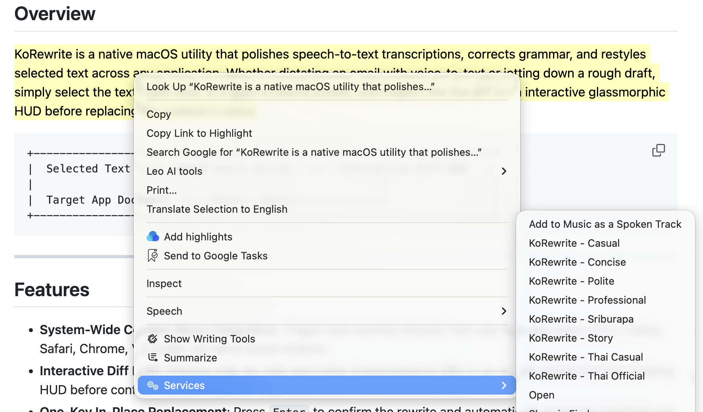
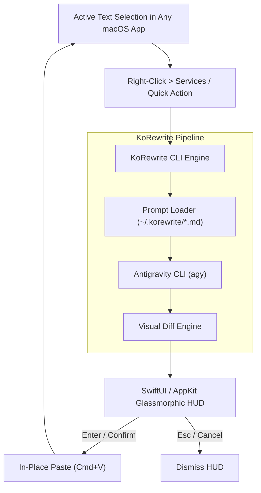

# KoRewrite

<div align="center">

[](https://www.apple.com/macos/)
[](https://www.swift.org/)
[](LICENSE)
[]()

**Native macOS in-place text rewriting and speech-to-text post-processing tool powered by Antigravity (`agy`).**

[Prerequisites](#prerequisites) • [Quick Start](#quick-start) • [Features](#features) • [Architecture](#architecture) • [Usage Guide](USAGE.md) • [Design System](DESIGN.md)

</div>

---

## Overview

KoRewrite is a native macOS utility that polishes speech-to-text transcriptions, corrects grammar, and restyles selected text across any application. Whether dictating an email with voice-to-text or jotting down a rough draft, simply select the text, right-click to trigger a rewrite preset, and inspect the live diff in an interactive glassmorphic HUD before replacing the content in place.

```
+-----------------------------------------------------------------------+
|  Selected Text  ──>  macOS Quick Action  ──>  Interactive Diff HUD   |
|                                                      │                |
|  Target App Document  <── [Enter: Apply] <───────────┘                |
+-----------------------------------------------------------------------+
```

---

## Features

- **System-Wide Context Menu Integration**: Trigger text rewrites directly from any Mac app (Mail, Slack, Notes, Safari, Chrome, VS Code) via native Quick Actions.
- **Interactive Diff HUD**: Preview side-by-side and inline character/word diffs in an AppKit glassmorphism floating HUD before confirming replacements.
- **One-Key In-Place Replacement**: Press `Enter` to confirm the rewrite and automatically paste the polished text back into the active application.
- **Dynamic Markdown Presets**: Prompt templates live in `~/.korewrite/*.md`. Add or modify rewrite styles on the fly without recompiling.
- **Local AI Execution**: Powered by your local Antigravity (`agy`) CLI engine with zero telemetry and complete privacy.
- **Multilingual Support**: Out-of-the-box presets for English and Thai styles (Polite, Professional, Concise, Casual, Sriburapa, Story, and Thai Official).



---

## Architecture



---

## Prerequisites

Ensure your system meets the following requirements before setting up KoRewrite:

1. **macOS Sonoma (14.0+) / Sequoia / Tahoe (26.0+)**
   - Uses native AppKit and Accessibility APIs.

2. **Google Antigravity CLI (`agy`) & OAuth Authentication**
   - KoRewrite leverages the local `agy` engine for LLM rewrites.
   - Verify installation and log in:
     ```bash
     agy --version
     agy auth login
     ```

3. **Swift 6.0+ Toolchain** *(Required for building from source)*
   - Included with Xcode 16+ or Command Line Tools (`xcode-select --install`).
   - Verify toolchain:
     ```bash
     swift --version
     ```

4. **User Binary Path (`~/.local/bin`)**
   - Ensure `~/.local/bin` is present in your shell's `$PATH` (e.g. in `~/.zshrc`):
     ```bash
     export PATH="$HOME/.local/bin:$PATH"
     ```

5. **macOS Accessibility Privileges**
   - Required to perform in-place text replacement in active applications.

---

## Quick Start

### 1. Install Binary

**Option A: Pre-built Binary**
Download the latest `korewrite` release binary and place it in your `PATH`:
```bash
chmod +x korewrite
mv korewrite ~/.local/bin/
```

**Option B: Build from Source**
```bash
# Clone the repository
git clone https://github.com/korakot/korewrite.git
cd korewrite

# Build release binary
swift build -c release

# Install CLI binary to ~/.local/bin
mkdir -p ~/.local/bin
cp .build/release/korewrite ~/.local/bin/
```

### 2. Register macOS Services

Register the Quick Action services in `~/Library/Services/` directly via the CLI:

```bash
korewrite --install-services
```

*(If working from the cloned repo, `./scripts/install-services.sh` also works).*

### 3. Grant Accessibility Permissions

To allow KoRewrite to replace text in target apps:
1. Open **System Settings** > **Privacy & Security** > **Accessibility**.
2. Enable permissions for **Terminal**, **iTerm**, and **Automator / Services**.

---

## Usage

### Interactive Floating HUD

Select text in any app, or pipe text via terminal:

```bash
echo "can u send me the doc ASAP" | korewrite --style professional --hud
```

- **Enter / Return**: Confirm rewrite and replace selected text.
- **Esc**: Dismiss HUD without modifying original text.

### Direct CLI Rewriting

```bash
# Rewrite text using argument
korewrite --style polite --text "I am late today"

# Rewrite text using standard input
echo "can u send me the doc ASAP" | korewrite --style concise
```

### Listing Available Styles

```bash
korewrite --list-styles
```

### Refreshing & Synchronizing macOS Services

When adding, editing, or deleting templates in `~/.korewrite/`, dynamically update your right-click Services menu and prune orphaned workflows:

```bash
korewrite --refresh
```

---

## Prompt Presets & Customization (`~/.korewrite`)

All prompt templates are stored as plain Markdown files in `~/.korewrite/`. You can navigate to this directory to inspect how existing styles are structured, tweak their prompts, or create entirely new rewrite presets.

### Included Styles

| Style | File | Purpose & Target Tone |
| :--- | :--- | :--- |
| **`polite`** | `~/.korewrite/polite.md` | Courteous, respectful, and considerate phrasing for workplace communication. |
| **`professional`** | `~/.korewrite/professional.md` | Polished, articulate, and clear business communication. |
| **`concise`** | `~/.korewrite/concise.md` | High-impact editing that removes fluff and redundant verbiage. |
| **`casual`** | `~/.korewrite/casual.md` | Friendly, approachable, and natural conversation. |
| **`sriburapa`** | `~/.korewrite/sriburapa.md` | Literary prose inspired by Kulap Saipradit (Sriburapa). |
| **`story`** | `~/.korewrite/story.md` | Vivid, narrative-driven storytelling style. |
| **`thai-official`** | `~/.korewrite/thai-official.md` | Formal and bureaucratic Thai administrative tone. |

### Inspecting & Modifying Existing Prompts

Open any template in `~/.korewrite/` with your preferred editor to view or tune its instructions:

```bash
# View all installed prompt templates
ls -la ~/.korewrite

# Inspect or edit a specific style
nano ~/.korewrite/professional.md
```

### Adding New Custom Styles

To add a new rewrite style, create a new `.md` file in `~/.korewrite/` (e.g. `~/.korewrite/executive.md`). You can optionally provide a custom display name using YAML frontmatter:

```markdown
---
name: KoRewrite - Executive Brief
---
# Role: Executive Brief Rewriter

Rewrite the selected text for senior leadership:
- Lead directly with key outcomes and decisions.
- Strip out low-level technical details and redundant filler.
- Keep phrasing decisive, concise, and structured.
```

- **Frontmatter**: `name:` (or `displayName:`) controls how the action appears in the right-click Services menu. If omitted, KoRewrite automatically derives a clean name from the filename (e.g., `bullet-summary.md` becomes `KoRewrite - Bullet Summary`).
- **Prompt Body**: Everything below the frontmatter is passed to the AI engine as style guidelines.

### Synchronizing Changes (`korewrite --refresh`)

Whenever you add, modify, or delete templates in `~/.korewrite/`, run:

```bash
korewrite --refresh
```

This command scans `~/.korewrite/`, regenerates your macOS Quick Actions in `~/Library/Services/`, prunes any removed workflows, and flushes the system Services cache so your context menu updates immediately.

---

## Documentation

- [USAGE.md](file:///Users/korakot/dev/korewrite/USAGE.md) - Comprehensive build instructions, local development guide, and test suite commands.
- [DESIGN.md](file:///Users/korakot/dev/korewrite/DESIGN.md) - macOS Tahoe 26 design system, typography, colors, and HUD tokens.
- [PROJECT.md](file:///Users/korakot/dev/korewrite/PROJECT.md) - Problem statement, architectural direction, and roadmap.

---

## Development & Testing

```bash
# Run unit and integration tests
swift test

# Build debug binary
swift build
```

---

## License

This project is licensed under the MIT License.
