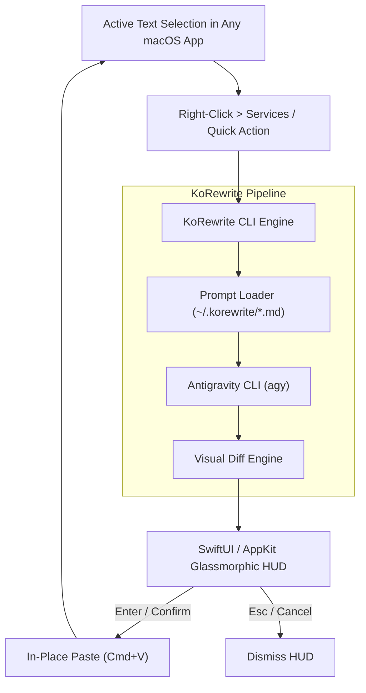

# KoRewrite

<div align="center">

[](https://www.apple.com/macos/)
[](https://www.swift.org/)
[](LICENSE)
[]()

**Native macOS in-place text rewriting and speech-to-text post-processing tool powered by Antigravity (`agy`).**

[Quick Start](#-quick-start) • [Features](#-features) • [Architecture](#-architecture) • [Usage Guide](file:///Users/korakot/dev/korewrite/USAGE.md) • [Design System](file:///Users/korakot/dev/korewrite/DESIGN.md)

</div>

---

## Overview

KoRewrite is a native macOS utility that polishes speech-to-text transcriptions, corrects grammatical mistakes, and restyles selected text across any macOS application.
It integrates directly into the macOS Services right-click context menu and presents an interactive, glassmorphic floating HUD with live diff highlighting before replacing text in-place.

```
+-----------------------------------------------------------------------+
|  Selected Text  ──>  macOS Quick Action  ──>  Interactive Diff HUD   |
|                                                      │                |
|  Target App Document  <── [Enter: Apply] <───────────┘                |
+-----------------------------------------------------------------------+
```

---

## Features

- **System-Wide Context Menu Integration**: Trigger text rewrites directly from any Mac app (Mail, Slack, Notes, Safari, Chrome, VS Code) via native Quick Actions.
- **Interactive Diff HUD**: Preview side-by-side and inline character/word diffs in an AppKit glassmorphism floating HUD before confirming replacements.
- **One-Key In-Place Replacement**: Press `Enter` to confirm the rewrite and automatically paste the polished text back into the active application.
- **Dynamic Markdown Presets**: Prompt templates live in `~/.korewrite/*.md`. Add or modify rewrite styles on the fly without recompiling.
- **Local AI Execution**: Powered by your local Antigravity (`agy`) CLI engine with zero telemetry and complete privacy.
- **Multilingual Support**: Out-of-the-box presets for English and Thai styles (Polite, Professional, Concise, Casual, Sriburapa, Story, and Thai Official).

---

## Architecture



---

## Quick Start

### 1. Build and Install

```bash
# Clone the repository
git clone https://github.com/korakot/korewrite.git
cd korewrite

# Build release binary
swift build -c release

# Install CLI binary to ~/.local/bin
mkdir -p ~/.local/bin
cp .build/release/korewrite ~/.local/bin/korewrite
```

### 2. Register macOS Services

Run the automated installer script to register Quick Actions in `~/Library/Services/`:

```bash
./scripts/install-services.sh
```

### 3. Grant Accessibility Permissions

To allow KoRewrite to replace text in target apps:
1. Open **System Settings** > **Privacy & Security** > **Accessibility**.
2. Enable permissions for **Terminal**, **iTerm**, and **Automator / Services**.

---

## Usage

### Interactive Floating HUD

Select text in any app, or pipe text via terminal:

```bash
echo "can u send me the doc ASAP" | korewrite --style professional --hud
```

- **Enter / Return**: Confirm rewrite and replace selected text.
- **Esc**: Dismiss HUD without modifying original text.

### Direct CLI Rewriting

```bash
# Rewrite text using argument
korewrite --style polite --text "I am late today"

# Rewrite text using standard input
echo "can u send me the doc ASAP" | korewrite --style concise
```

### Listing Available Styles

```bash
korewrite --list-styles
```

---

## Included Prompt Presets

| Style | Purpose & Target Tone |
| :--- | :--- |
| **`polite`** | Courteous, respectful, and considerate phrasing for workplace communication. |
| **`professional`** | Polished, articulate, and clear business communication. |
| **`concise`** | High-impact editing that removes fluff and redundant verbiage. |
| **`casual`** | Friendly, approachable, and natural conversation. |
| **`sriburapa`** | Literary prose inspired by Kulap Saipradit (Sriburapa). |
| **`story`** | Vivid, narrative-driven storytelling style. |
| **`thai-official`** | Formal and bureaucratic Thai administrative tone. |

To add a custom style, create `~/.korewrite/[my-style].md`.
It is automatically detected by the CLI and macOS Services.

---

## Documentation

- [USAGE.md](file:///Users/korakot/dev/korewrite/USAGE.md) - Comprehensive build instructions, local development guide, and test suite commands.
- [DESIGN.md](file:///Users/korakot/dev/korewrite/DESIGN.md) - macOS Tahoe 26 design system, typography, colors, and HUD tokens.
- [PROJECT.md](file:///Users/korakot/dev/korewrite/PROJECT.md) - Problem statement, architectural direction, and roadmap.

---

## Development & Testing

```bash
# Run unit and integration tests
swift test

# Build debug binary
swift build
```

---

## License

This project is licensed under the MIT License.
